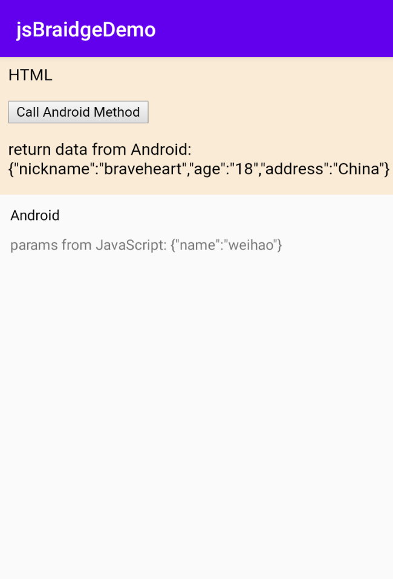
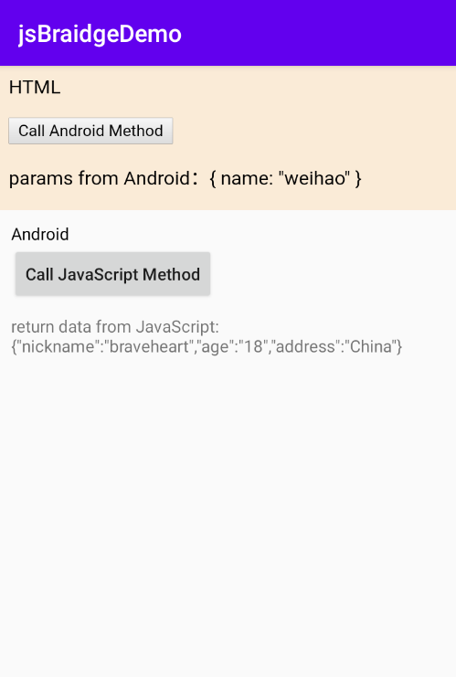

## 前言

因为[JsBridge](https://github.com/lzyzsd/JsBridge)里的`example`内容很多，自己第一次看这个东西，一下子还是一头雾水的，关于`Android`与`JavaScript`的交互，之前都是直接使用`WebView`来实现的，可是后来并没有深入去研究这个东西，原先项目使用到的`WebView`，也因为紧紧只是展示`html`页面，为了优化，也换成了[TBS 腾讯浏览服务](https://x5.tencent.com)，之后再也没接触到 Android 与 JS 交互相关的知识，就趁这个机会，把这方面的一点一点心得记录一下。

## 准备工作

1.首先，需要在根目录下的`build.gradle`文件中加上：

```
repositories {
    // ...
    maven { url "https://jitpack.io" }
}
```

2.然后，需要在`app`目录下的`build.gradle`文件中加上依赖：

```
implementation 'com.github.lzyzsd:jsbridge:1.0.4'
```

## 开始使用

**一、实现通过 JavaScript 调用 Android 方法**

1.在`src/main`文件夹下新建一个`assets`文件夹，然后在里面新建一个`demo.html`文件，内容如下所示：

```
<html>
<head>
    <meta content="text/html; charset=utf-8" http-equiv="content-type" />
</head>

<body style="background-color:antiquewhite;">
HTML
<p>
    <input type="button" value="Call Android Method" onclick="testClicked()" />
</p>
<p style="width: 100%;">
    <span id="show">Show Contents:</span>
</p>
</body>
<script>
    function testClicked() {
      window.WebViewJavascriptBridge.callHandler(
        "jsCallAndroid",
        { name: "weihao" },
        function(responseData) {
          document.getElementById("show").innerHTML = responseData;
        }
      );
    }
    /**
      这个库将把WebViewJavascriptBridge对象注入到窗口对象。
      所以在您的js中，在使用WebViewJavascriptBridge之前，
      必须检测WebViewJavascriptBridge是否存在。
      如果WebViewJavascriptBridge未退出，
      则可以侦听WebViewJavascriptBridgeReady事件
    */
    connectWebViewJavascriptBridge(function(bridge) {
      bridge.init(function(message, responseCallback) {
        if (responseCallback) {
          responseCallback(data);
        }
      });
    });
    function connectWebViewJavascriptBridge(callback) {
      if (window.WebViewJavascriptBridge) {
        callback(WebViewJavascriptBridge);
      } else {
        document.addEventListener(
          "WebViewJavascriptBridgeReady",
          function() {
            callback(WebViewJavascriptBridge);
          },
          false
        );
      }
    }
  </script>
</html>
```

2.需要在`activity_main.xml`文件中，加上布局：

```
    <com.github.lzyzsd.jsbridge.BridgeWebView
        android:id="@+id/bridgeWebview"
        app:layout_constraintTop_toTopOf="parent"
        android:layout_width="match_parent"
        android:layout_height="wrap_content"/>
    <TextView
        android:id="@+id/tv_content"
        app:layout_constraintTop_toBottomOf="@+id/bt_calljs"
        app:layout_constraintLeft_toLeftOf="@+id/bt_calljs"
        android:layout_width="wrap_content"
        android:layout_marginTop="10dp"
        android:text="Content"
        android:layout_height="wrap_content"/>
```

3.在`MainActivity.java`中注册一个方法`jsCallAndroid`，用于`JS`调用，并且使用`loadUrl`加载`demo.html`文件，代码如下所示：

```
        bridgeWebview.registerHandler("jsCallAndroid", new BridgeHandler() {
            @Override
            public void handler(String data, CallBackFunction function) {
                tvContent.setText("params from JavaScript: " + data);
                JSONObject jsonObject = new JSONObject();
                try {
                    jsonObject.put("nickname", "braveheart");
                    jsonObject.put("age", "18");
                    jsonObject.put("address", "China");
                } catch (JSONException e) {
                    e.printStackTrace();
                }
                function.onCallBack("return data from Android: "+jsonObject.toString());
            }
        });
        bridgeWebview.loadUrl("file:///android_asset/demo.html");
```

上面主要是为了使`Android`与`JS`的交互更为形象，所以就模拟成一个网络请求获取用户信息的方式来说明，其意思是，当从`JS`调用这个`Android`方法`jsCallAndroid`时，需要传入参数`data`，也就是`{ "name" : "weihao" }`，然后会从`Android`返回用户信息，也就是：

```
{"nickname":"braveheart","age":"18","address":"China"}
```

4.运行效果，如下图所示：



上部分是`demo.html`文件页面，下部分是`Android`原生页面，其中可以看到，当点击`Call Android Method`按钮时，`JS`调用`Android`方法`jsCallAndroid`，`Android`页面的`TextView`控件获取到了传过来的参数`{ "name" : "weihao" }`，并且在`demo.html`页面确实从`Android`返回了用户信息：

```
{"nickname":"braveheart","age":"18","address":"China"}
```

**二、实现在 Android 里调用 JavaScript 方法**

1.在`activity_main.xml`文件中，加上一个`Button`控件，代码如下所示：

```
    <Button
        android:id="@+id/bt_call_js"
        app:layout_constraintTop_toBottomOf="@+id/tv_android"
        app:layout_constraintLeft_toLeftOf="@+id/tv_android"
        android:layout_width="wrap_content"
        android:textAllCaps="false"
        android:text="Call JavaScript Method"
        android:layout_height="wrap_content"/>
```

2.需要在`demo.html`文件里的`connectWebViewJavascriptBridge`方法里加上一个让`Android`调用的方法`androidCallJS`，代码如下所示：

```
      bridge.registerHandler("androidCallJS", function(data, responseCallback) {
        document.getElementById("show").innerHTML =
          "params from Android：" + data;
        if (responseCallback) {
          var responseData = `{"nickname":"braveheart","age":"18","address":"China"}`;
          responseCallback(responseData);
        }
      });
```

3.在`MainActivity.java`中加上如下代码，用于调用`JS`里的`androidCallJS`方法，代码如下所示：

```
        btCallJS.setOnClickListener(new View.OnClickListener() {
            @Override
            public void onClick(View view) {
                bridgeWebview.callHandler("androidCallJS","{ name: \"weihao\" }", new CallBackFunction() {
                    @Override
                    public void onCallBack(String data) {
                        tvContent.setText("return data from JavaScript: "+data);
                    }
                });
            }
        });
```

以上也是通过模拟网络请求获取用户信息的方式，来形象说明`Android`与`JS`的交互，只不过改成了从`Android`传入用户名，从`JS`返回用户信息而已。

4.运行效果，如下图所示：


